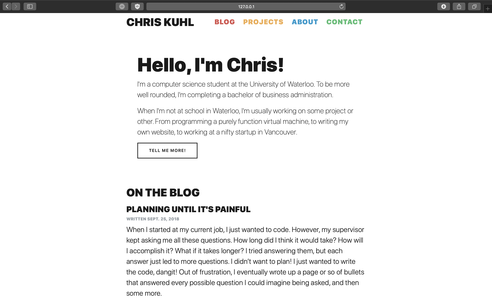

I've been working on a website in some form or other for a couple of years now but every time it was an ordeal with choosing a framework and then trying to get it to work. So this time around I decided to lay out what my requirements were first, and then make a decision based on that criteria.

### Familiar tooling

As a side project, I don't have a lot of time to dedicate so I want to be as efficient as possible. So the obvious choice of programming language was Python.

### Simple content format

If I do change things in the future, I want to be able to take my documents with me easily.

### Simple modules
I wanted to avoid fiddling with settings and various files in order to get the extensions I need working.

## Decision

With these requirements in mind, I went with the [Flask](http://flask.pocoo.org/) micro web development framework for Python, as well as [Flask-Flatpages](http://flask-flatpages.readthedocs.io/en/latest/) to host static content written in a mix of YAML and Markdown. Flask was chosen because it is a very low-cost server in terms of learning the system, and Flask-Flatpages for its fantastic formatting and ease of integration with Flask.

In addition, I have recently updated my site to use Bootstrap, because it is an easy way to make my site look nice without needing to fiddle around with the styling myself. This way I can focus more on writing good content.
