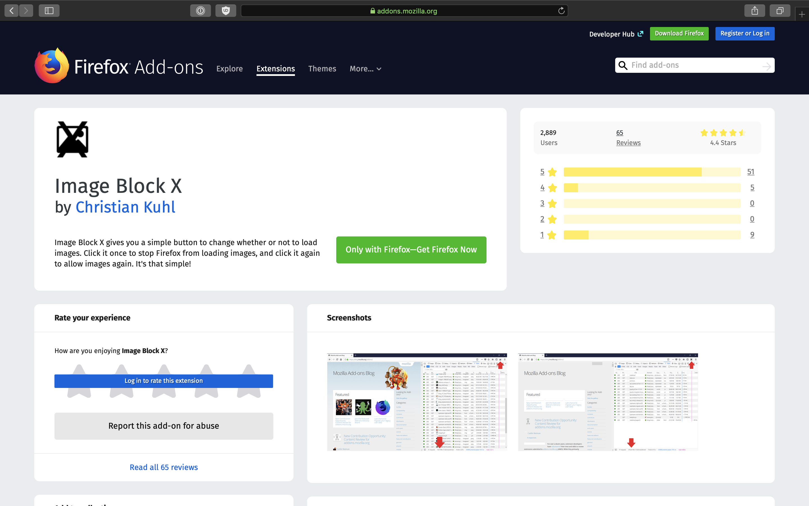

This was a small project to learn the ropes of how to make web extensions. Image Block X replicates the functionality of the Firefox add-on [Image Block](https://addons.mozilla.org/en-US/firefox/addon/image-block/), which was built using Firefox's deprecated "XUL" API. Simply put, it was a toggle button to enable or disable loading images in the browser. I had found it useful when tethering to my phone during the summer, and wanted to make sure I could continue to use this functionality even after Firefox removed the XUL system.

What I didn't expected when developing the extension was just how many other people were also looking for a replacement for the extension. Within the first month it had 50 users, by month three it had 500 users, and a year and a half since the initial release, it has stablized at just under 3000 daily active users.

What I didn't expect was how invested some users would become with the extension. Not just giving ratings and reviews, but writing personal emails, creating GitHub issues, and even [writing pull requests](https://github.com/ckuhl/ImageBlockX/pull/9)! Overall it's been a very humbling experience to see how the code I write can have a real impact on people around the world.