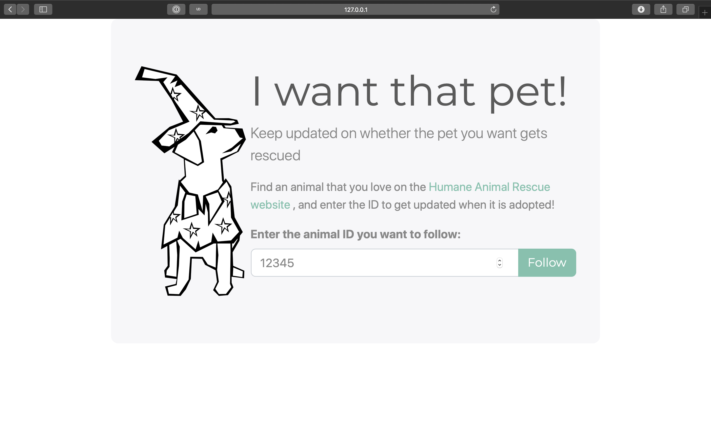

A friend of mine reached out to me recently. Do I know of any easy way to monitor a website for changes? I knew that it would be fairly easy to do for myself. However setting up a server, cron, and a script to diff the site is not easy for someone who doesn't have the time to learn all that.

So I had a project: create a website that would keep someone posted if the animal they wanted (but could not get due to their current lease) was adopted from the animal shelter. I came up with the following set of goals at the start of the project:

- allow users to sign up for updates
- update users by email
- do it in under a week (working ~1 hour each night)

## Project

I went with the lightest & quickest tools I knew to build the site. Python with [Flask](http://flask.pocoo.org/) for the framework and [Peewee](http://docs.peewee-orm.com/en/latest/) for the ORM, [Mailgun](https://www.mailgun.com/) to send email updates, and I reused an Ansible playbook from my website to deploy the site.

## Outcome

[iwantthat.pet](https://iwantthat.pet/) has been a success in my books. The project took slightly more than an hour each night, mostly due to my unfamiliarity with Peewee. That being said, I'll be quicker to work with it (or any other ORM) moving forwards now.

The only (minor) difficulty I faced was a difficulty scheduling jobs within Python. I think if I were to do this project again, I would create a separate script for periodic functions, and register a cron job from my Ansible playbook rather than try to do everything inside of Python. There is definitely a benefit to keeping all the functionality of a project in one place. However these benefits come with trade-offs that in this case were not worth it.
